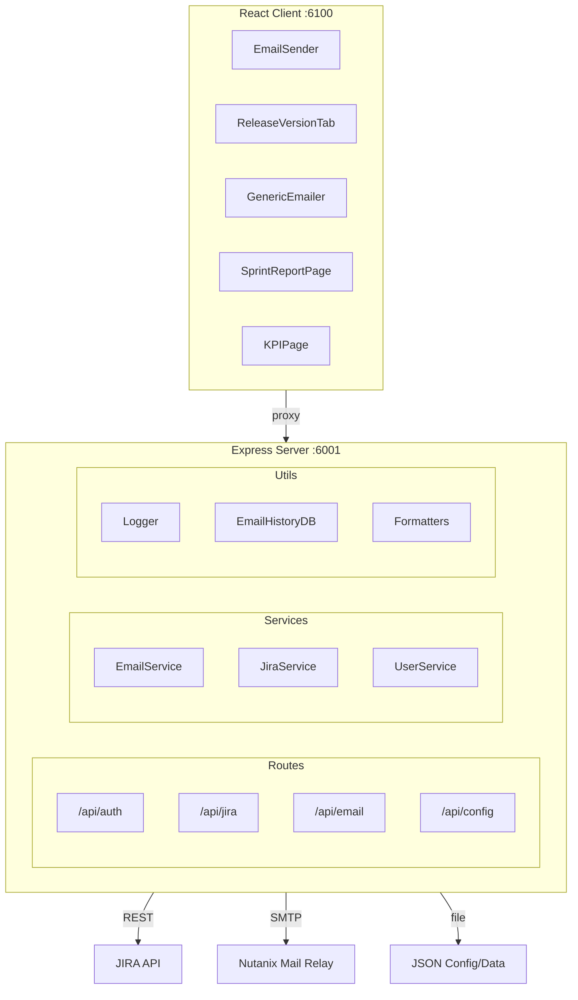

# NDB Status Update Sender – Developer Guide

This guide helps new developers assimilate the codebase quickly. For end-user usage, see [README.md](README.md).

---

## 1. Project Overview

**NDB Status Update Sender** is a full-stack web application for the NDB team at Nutanix. It:

1. **Sends status update emails** – Confluence content, JIRA ticket data, and release info
2. **Tracks JIRA release versions** – Issues by fix version, checkpoint dates, Gantt charts
3. **Generic JIRA Emailer** – Run any JQL, choose columns, and email results
4. **Scheduled emails** – Cron-based reminders from JQL queries
5. **KPIs and release trends** – Team metrics and release trends

It integrates with **Confluence**, **JIRA**, and **SMTP** (Nutanix mail relay). Data and config are stored in JSON files (no SQL database).

---

## 2. Architecture

### High-Level Flow

```
┌─────────────────────────────────────────────────────────────────┐
│                     React Client (port 6100)                      │
│  Email Sender | Release Versions | Generic Emailer | KPIs | etc.  │
└────────────────────────────┬────────────────────────────────────┘
                             │ proxy → localhost:6001
                             ▼
┌─────────────────────────────────────────────────────────────────┐
│                  Express Server (port 6001)                       │
│  /api/config | /api/auth | /api/jira | /api/email | /api/status   │
└──────┬──────────────┬──────────────┬──────────────┬─────────────┘
       │              │              │              │
       ▼              ▼              ▼              ▼
  Confluence      JIRA API      SMTP Relay    JSON file DB
  (optional)      (REST v2)     (Nutanix)     (emailHistory, etc.)
```

### Mermaid Diagram



### Directory Structure

```
ndb-status-update-sender/
├── client/                        # React 18 frontend
│   ├── src/
│   │   ├── App.js                 # Main app, routing, auth
│   │   ├── components/            # UI components — render only, no direct fetch calls
│   │   ├── constants/             # Shared UI constants (never inline in components)
│   │   │   └── releaseStatus.js   # JIRA_COLOR_MAP, RISK_COLOR_MAP, status sets
│   │   ├── hooks/                 # Custom hooks — all data fetching lives here
│   │   │   ├── index.js           # Barrel export for all hooks
│   │   │   ├── useTeams.js        # GET /api/config/teams (shared across 4 pages)
│   │   │   ├── useGenericEmailerConfig.js
│   │   │   ├── useReleaseItems.js
│   │   │   ├── useTcmsData.js
│   │   │   └── ...
│   │   ├── services/              # API call wrappers — one function per endpoint group
│   │   │   ├── confluenceService.js   # populate, extract Confluence pages
│   │   │   ├── jiraQueryService.js    # ad-hoc JQL execution
│   │   │   └── taskBreakdownService.js
│   │   └── utils/
│   │       ├── api.js             # authenticatedPost/Get helpers (use these, not axios)
│   │       ├── jiraFields.js      # ALL customfield_NNNNN constants — import, never inline
│   │       └── jiraConfig.js
│   └── package.json
├── server/                        # Node.js/Express backend
│   ├── index.js                   # Entry point, middleware, route mounting
│   ├── config/                    # JSON configs (email, JIRA, Confluence, allowedUsers, etc.)
│   │   └── jiraFieldsConfig.json  # Server-side JIRA field registry (source of truth)
│   ├── routes/                    # Thin route handlers — validate → call service → respond
│   ├── services/                  # Business logic, orchestration
│   ├── middleware/                # security, validation, auth/jira
│   ├── utils/                     # Pure utilities — jiraQueryUtils, ganttChartEmailGenerator, etc.
│   └── data/                      # emailHistory.json (JSON file DB)
├── .cursor/
│   ├── rules/                     # AI coding rules (always applied)
│   │   ├── minimal-architecture.mdc          # Layer boundaries, file size limits, field ID constants
│   │   ├── documentation-consistency.mdc     # Report naming, skill section standards
│   │   ├── no-localhost.mdc                  # No hardcoded localhost in app code
│   │   ├── nutanix-jira-date-hierarchy.mdc   # JIRA date field logic by issue type
│   │   └── react-useeffect-infinite-loop-prevention.md
│   └── skills/                    # AI task skills
│       ├── team-exec-release-report/
│       ├── fetch-project-tickets/
│       ├── sprint-gantt-chart/
│       ├── predictive-team-exec-analytics/
│       └── confluence-width-cleanup/
├── reports/                       # Generated Team Executive/Sprint/Prediction reports (with frontmatter)
├── docs/                          # REQUIREMENTS.md, TECH_DESIGN.md, TEST_PLAN.md
└── package.json                   # Root: concurrently runs server + client
```

---

## 3. Main Features

### Email Sender (`/`)

- **Auth**: JIRA API token (validated via `/rest/api/2/myself`)
- **JIRA ticket**: Enter JIRA key, fetch ticket, epics, issue breakdown
- **Highlights & Lowlights**: Rich text (ReactQuill) with required sections
- **Recipients**: Semicolon-separated; normalized to `@nutanix.com`
- **Send**: HTML email with JIRA data, epics, issue breakdown; CC from config and JIRA people
- **Test / dry run**: Send only to self or log without sending
- **Open in Outlook**: Fallback to mailto or Outlook Web when SMTP is unreliable

### Release Versions (`/all-status`)

- **Release selector**: Fetch versions from JIRA project (e.g. ERA)
- **Release items table**: Configurable columns, checkpoint dates, history
- **Gantt chart**: Timeline of items; can be embedded in email
- **Release email**: Consolidated status with highlights, lowlights, call to action, table, Gantt
- **Access**: `allowedUsers` in `allowedUsers.json`; `RELEASE_VERSIONS_PAGE_ACCESS` env

### Generic Emailer (`/generic-emailer`)

- **JQL**: Run any JQL (e.g. `project = ERA AND statusCategory != Done`)
- **Column selection**: Only fields with data; drag-and-drop reorder
- **Subject/body**: Optional subject (date appended) and rich-text body
- **Recipients**: To, CC from config, optional project team (assignee, QA, PM, etc.)
- **Send**: One email with body + table; empty cells as N/A
- **Access**: `genericEmailerAllowedUsers` (or allowlist)

### Scheduled Emails

- **Cron**: `node-cron` every minute
- **Config**: JQL, columns, recipients, schedule (day, hour, minute, timezone)
- **Token**: `JIRA_SCHEDULED_EMAIL_TOKEN` for scheduled sends
- **Storage**: `scheduledEmailsDB` (JSON file)

### Sprint Report (`/sprint-report`)

- **Report types**: Past sprint, current sprint, or trends by team
- **Team**: Selected from header; base filter from `teamBoardConfig.json` (e.g. board 2888)
- **Metrics**: Total in sprint, added after start, removed, completed, pending QA, incomplete; CSV download
- **Access**: `sprintReportAllowedUsers` in `allowedUsers.json`. See [SPRINT_REPORT_CONTEXT.md](SPRINT_REPORT_CONTEXT.md) for design and limits.

### Other

- **Email history**: List/delete sent emails (for `emailHistoryAllowedUsers`)
- **Release trends**: Status snapshots and trends
- **KPIs**: Team KPIs from JQL; configurable per team
- **Release setup**: Version creation, filters (for `releaseSetupAllowedUsers`)

---

## 4. Key Files Reference

### Server

| File | Purpose |
|------|---------|
| `server/index.js` | Express app, middleware, route mounting |
| `server/routes/email/` | Email sending: sendEmail, sendReleaseVersions, sendGenericReminder, preview, schedules, history |
| `server/routes/jira/index.js` | JIRA API proxy — validate, fetch, search-by-jql, release versions, sprint-report, KPIs |
| `server/services/emailService.js` | SMTP transporter, sendEmailDirect, wrapReleaseVersionsEmailHTML, parseEmailRecipients |
| `server/utils/jiraClient.js` | CJS adapter onto shared `JiraConnector` (`getJira`, `searchPages`) |
| `server/services/jiraService.js` | Risk-indicator presentation helpers only |
| `server/services/userService.js` | Username/email normalization, JIRA user extraction, auth checks |
| `server/config/jiraFieldsConfig.json` | **Single source of truth** for all JIRA custom field IDs (server side) |
| `server/utils/jiraQueryUtils.js` | JQL query builders — import here, don't inline JQL in route handlers |

### Client

| File | Purpose |
|------|---------|
| `client/src/App.js` | Routes, auth state, layout |
| `client/src/components/EmailSender/` | Main email form — JIRA key, highlights/lowlights, send |
| `client/src/components/ReleaseVersionTab.js` | Release versions UI (render only — fetching via hooks) |
| `client/src/components/GenericEmailer.js` | JQL-based emailer UI |
| `client/src/utils/api.js` | `authenticatedPost`, `authenticatedGet` — **use these, not raw axios** |
| `client/src/utils/jiraFields.js` | **Single source of truth** for all `customfield_NNNNN` constants (client side) |
| `client/src/constants/releaseStatus.js` | JIRA colour maps, risk colour map, status keyword sets |
| `client/src/hooks/useTeams.js` | Shared hook: fetches `/api/config/teams` — used by KPI, Sprint, Trends, Emailer pages |
| `client/src/hooks/useGenericEmailerConfig.js` | Fetches `/api/config/generic-emailer` |
| `client/src/services/confluenceService.js` | `extractConfluencePage`, `populateJiraData`, `populateConfluencePage` |
| `client/src/services/jiraQueryService.js` | `runJqlQuery` — ad-hoc JQL via backend proxy |

---

## 5. Configuration Files

| Config | Purpose |
|--------|---------|
| `server/config/allowedUsers.json` | allowedUsers, releaseVersionsEmailSenders, emailHistoryAllowedUsers, kpiTabAllowedUsers, kpiAdminUsers, sprintReportAllowedUsers |
| `server/config/emailConfig.json` | SMTP host/port; optional smtp.from |
| `server/config/emailSenderCCConfig.json` | defaultCC for Email Sender |
| `server/config/releaseVersionsCCConfig.json` | defaultCC, versionDRIs for Release Versions email |
| `server/config/genericEmailerCCConfig.json` | defaultCC, optionalCCRecipients, projectTeamFields |
| `server/config/jiraFieldsConfig.json` | JIRA field IDs and display names |
| `server/config/releaseVersionsColumnsConfig.json` | Release table columns, checkpoint fields, releaseBaseFilters |
| `server/config/releaseVersionsEmailConfig.json` | Email notes order/labels for release email |
| `server/config/confluenceConfig.json` | Confluence base URL |
| `server/config/kpiConfig.json` | KPIs per team |
| `server/config/teamBoardConfig.json` | Teams, board IDs, sprint field |

---

## 6. Environment Variables

| Variable | Purpose |
|----------|---------|
| `PORT` | Server port (default 6001) |
| `NODE_ENV` | development / production |
| `SMTP_HOST`, `SMTP_PORT`, `SMTP_USER`, `SMTP_PASS` | SMTP relay (Nutanix) |
| `SMTP_FROM` | Optional; From address (must be service account for relay). Default from emailConfig.smtp.from. |
| `JIRA_TOKEN` | JIRA API token (server-side for some flows) |
| `RELEASE_VERSIONS_PAGE_ACCESS` | `all` \| `allowlist` \| `none` |
| `RELEASE_VERSIONS_EMAIL_ACCESS` | `all` \| `allowlist` \| `none` |
| `JIRA_SCHEDULED_EMAIL_TOKEN` | Token for cron-triggered emails |
| `ALLOWED_ORIGINS` | CORS origins (production) |
| `EMAIL_DRY_RUN` | If set, don't actually send email |

---

## 7. Email Sending Flow

1. **SMTP**: Nutanix Secure eMail Relay (`secure-mailrelay.corp.nutanix.com:587`), STARTTLS, auth from env. The legacy relay (`mailrelay.dyn.nutanix.com`) is deprecated; use the secure relay with a service account.
2. **emailService.js**: All mail sent via `sendEmailDirect(mailOptions)`. **From** is always the service account (`getDefaultFromAddress()` from config/env) so the relay accepts mail; **Reply-To** is set to the requesting user where applicable.
3. **To/CC by page**: Email Sender: To = defaultTo + user-entered recipients, CC = sender + others. Release Version: sender in CC. Generic Emailer: sender in CC.
4. **Endpoints**:
   - `POST /api/email/send` – Email Sender (JIRA ticket + highlights/lowlights)
   - `POST /api/email/send-release-versions` – Release Versions consolidated email
   - `POST /api/email/send-generic-reminder` – Generic Emailer (JQL table)
   - `POST /api/email/preview` – Returns to/cc/subject/body without sending (for "Open in Outlook")
5. **Fallback**: "Open in Outlook" uses mailto or Outlook Web link with preview data when SMTP is unreliable.

---

## 8. Authentication & Authorization

- **JIRA token**: Client stores in localStorage; sent as `Authorization: Bearer <token>`; validated via `/api/jira/validate` or `/rest/api/2/myself`.
- **Username**: From token validation (JIRA user email) or `X-Username` / `X-User-Email` header.
- **Release Versions**: `checkReleaseVersionsAuthorization` + `RELEASE_VERSIONS_EMAIL_ACCESS`.
- **Email history**: `emailHistoryAllowedUsers` in allowedUsers.json.
- **KPIs**: `checkKpiViewAuthorization` (view), `checkKpiTabAuthorization` + `checkKpiAdminAuthorization` (edit).
- **Sprint Report**: `checkSprintReportAuthorization` (uses `sprintReportAllowedUsers`). "Removed from sprint" metric is limited: Jira does not return issues that left the sprint; the value is often 0 unless history JQL (e.g. "Sprint was X") is supported.

---

## 9. Local Development

```bash
npm run install-all
npm run dev
```

- Backend: http://localhost:6001  
- Frontend: http://localhost:6100 (proxies API to 6001)

See [README.md](README.md) and [HOW_TO_RUN.md](HOW_TO_RUN.md) for setup and running.

---

## 10. Testing

- **Unit**: `npm run test:unit` (Jest, `__tests__`)
- **Integration**: `npm run test:integration`
- **E2E**: `npm run test:e2e`
- Config: `jest.config.js`, `jest.setup.js`

---

## 11. Logging & Audit

- **Logger**: `server/utils/logger.js` – `logger.email.attempt/sent/failed`, `logger.audit.action`
- **Email history**: `server/utils/emailHistoryDB.js` → `server/data/emailHistory.json`
- **Logging guide**: [LOGGING_GUIDE.md](LOGGING_GUIDE.md)

---

## 12. Refactored Structure (Post-Plan)

After the refactor from the improvement plan:

- **Email routes**: `server/routes/email/` (index, sendEmail, sendReleaseVersions, sendGenericReminder, schedules, history, middleware)
- **JIRA routes**: `server/routes/jira/` (index, auth, fetch, releaseVersions, search, kpi, helpers)
- **EmailSender UI**: `client/src/components/EmailSender/` (index, JiraTicketForm, JiraDataDisplay, EpicsSection, IssueBreakdown, HighlightsLowlightsEditor, EmailActions, hooks, utils)
- **Shared**: `client/src/components/shared/OutlookFallback.js` for "Open in Outlook" (mailto + OWA)

---

## 13. Architecture Rules (AI + Human)

The cross-project rules live at the user level under `~/.cursor/rules/` and apply to every NDB-Ops repo. Project-specific deltas live in this repo's `.cursor/rules/`. Both layers are enforced by the AI coding agent and code review. See also `~/.cursor/AGENTS.md` for the layered loading order.

### Layer boundaries — `minimal-architecture.mdc`

| Layer | Responsibility | Must NOT |
|---|---|---|
| `components/` | Render only | Call `axios` or `fetch` directly |
| `hooks/` | Data fetching | Contain JSX |
| `services/` | API call wrappers | Contain state |
| `server/routes/` | Validate + respond | Contain business logic inline |
| `server/services/` | Business logic | Contain route-level concerns |

**File size limits:**

| Layer | Soft warn | Hard limit |
|---|---|---|
| React component | 300 lines | 600 lines |
| Custom hook | 150 lines | 300 lines |
| Server route handler | 80 lines | 150 lines |
| Service / util | 200 lines | 500 lines |

**JIRA custom field IDs:**
- Client: always import from `client/src/utils/jiraFields.js` — never write `customfield_NNNNN` inline
- Server: always use `server/utils/jiraFieldsConfig.js` or `server/config/jiraFieldsConfig.json`

**API calls in components:**
- Wrong: `import axios from 'axios'` inside `components/`
- Right: create a hook in `hooks/` or service in `services/` and consume it

### Documentation standards — `documentation-consistency.mdc`

**Report file naming** (files in `reports/`):
```
{ReportType}-{Product}-{Release}-{YYYY-MM-DD}{-Variant}.{ext}
```
Example: `TeamExec-NDB-2.11-2026-05-08.md`

**Report frontmatter** (required in every `.md` report):
```yaml
---
report_type: Team Executive-Executive | Sprint | Detailed | KPI | Prediction
product: NDB
release: "2.11"
generated: YYYY-MM-DD
data_source: live | skill | manual
---
```

**Skill files** (`.cursor/skills/*/SKILL.md`) must contain in order:
1. `## When to Use This Skill`
2. `## Quick Start`
3. `## Core Rules`
4. `## Output Format`
5. `## Quality Validation`

### Other active rules (all live at `~/.cursor/rules/`)

| Rule file | Enforces |
|---|---|
| `no-localhost.mdc` | No hardcoded `localhost` in app code; use env vars or relative paths |
| `nutanix-jira-date-hierarchy.mdc` | JIRA date logic by issue type: gate dates (X-FEAT/Feature), duedate (Epic), sprint end (everything else) |
| `react-useeffect-infinite-loop-prevention.mdc` | All functions in `useEffect` deps → `useCallback`; all objects → `useMemo` |
| `confluence-cleanup-clarification.mdc` | Always ask before modifying Confluence HTML/XML content |
| `sprint-system.mdc` | 3-week sprints, Wednesday start, sequential naming (S1, S2…) |
| `sprint-velocity-types.mdc` | Three independent velocity streams: Dev, QA Verification, QA Test Tasks |
| `velocity-resolution-categories.mdc` | Resolution-status categorization for velocity math |
| `jira-authenticity-links.mdc` | Every displayed metric must be a JIRA hyperlink, not a bare number |
| `issue-type-grouping.mdc` | Portfolio (Feature/Initiative/Epic/X-FEAT/Capability) vs Work Items (Story/Task/Bug/Sub-task) |
| `release-types.mdc` | Dot notation classification of NDB releases (major / patch / RC) |
| `ui-density.mdc` | 13" laptop optimization for dashboards |
| `ai-metrics-documentation.mdc` | Structured `{value, source, jql}` format for every dashboard metric |
| `comprehensive-jql-and-metrics.mdc` | 5-component release payload structure |

---

This guide is the single place for architecture, features, config, and file roles so new developers can onboard quickly.
