# Technical Design Document

## 1. System Architecture

### 1.1 High-Level Architecture

The application follows a client-server architecture with clear separation between frontend and backend.

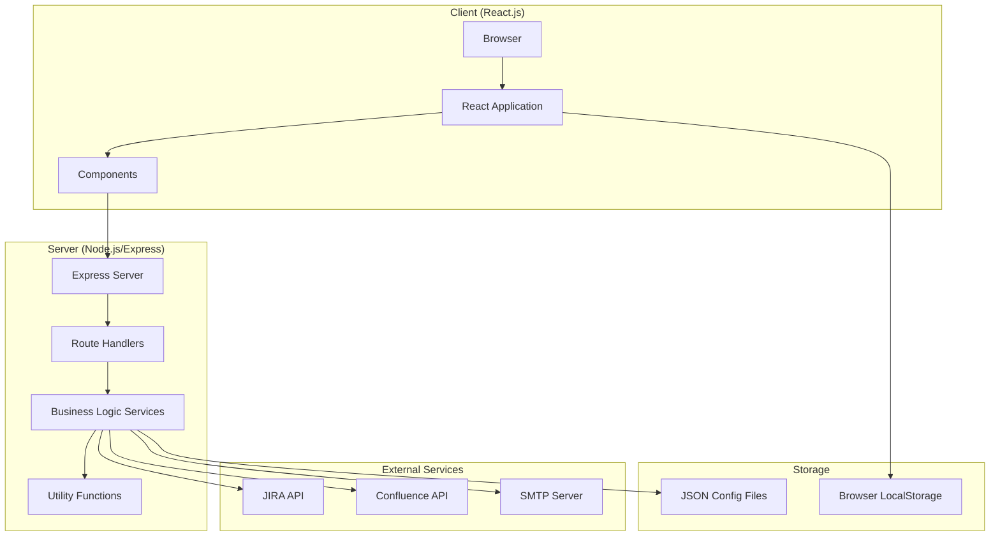

### 1.2 Technology Stack

#### Frontend
- **Framework**: React.js 18+
- **Routing**: React Router v6
- **HTTP Client**: Axios
- **Rich Text Editor**: ReactQuill
- **Styling**: CSS Modules + Inline Styles
- **Build Tool**: Create React App

#### Backend
- **Runtime**: Node.js 14+
- **Framework**: Express.js
- **HTTP Client**: Axios
- **Email**: Nodemailer
- **PDF Generation**: Puppeteer (optional)
- **Security**: express-rate-limit, helmet

#### External APIs
- **JIRA API**: REST API v2
- **Confluence API**: REST API
- **SMTP**: Gmail/Corporate SMTP

### 1.2 Deployment Architecture

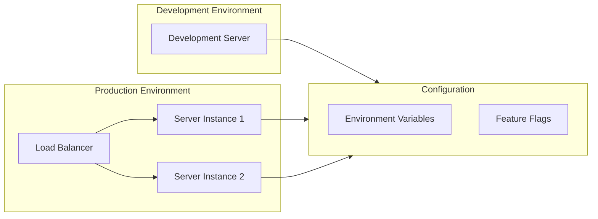

## 2. Component Architecture

### 2.1 Frontend Component Hierarchy

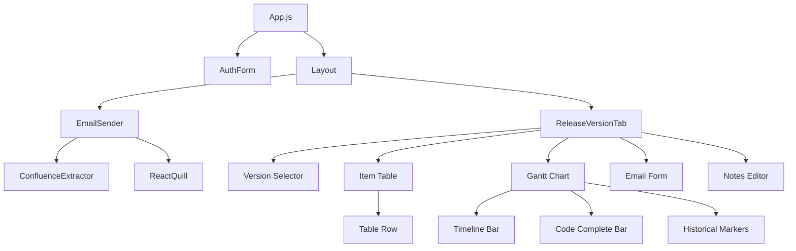

### 2.2 Backend Module Structure

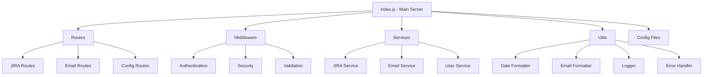

## 3. Data Flow

### 3.1 Authentication Flow

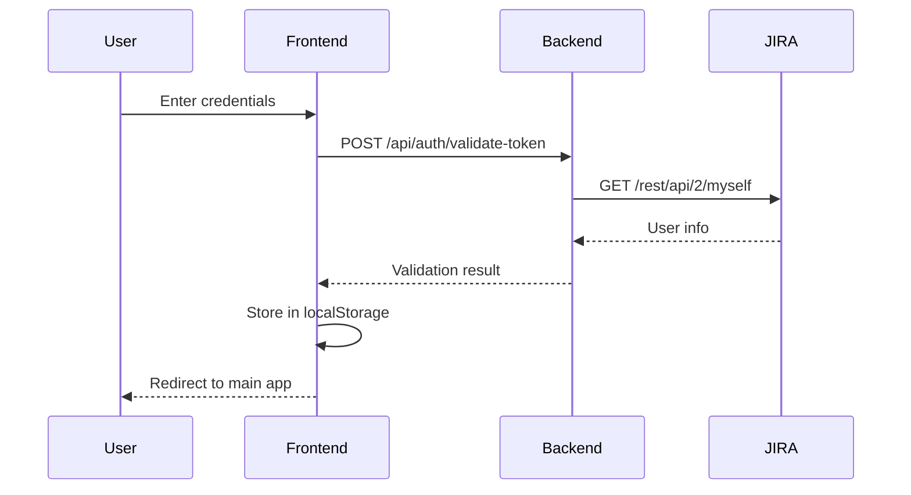

### 3.2 Email Sender Flow

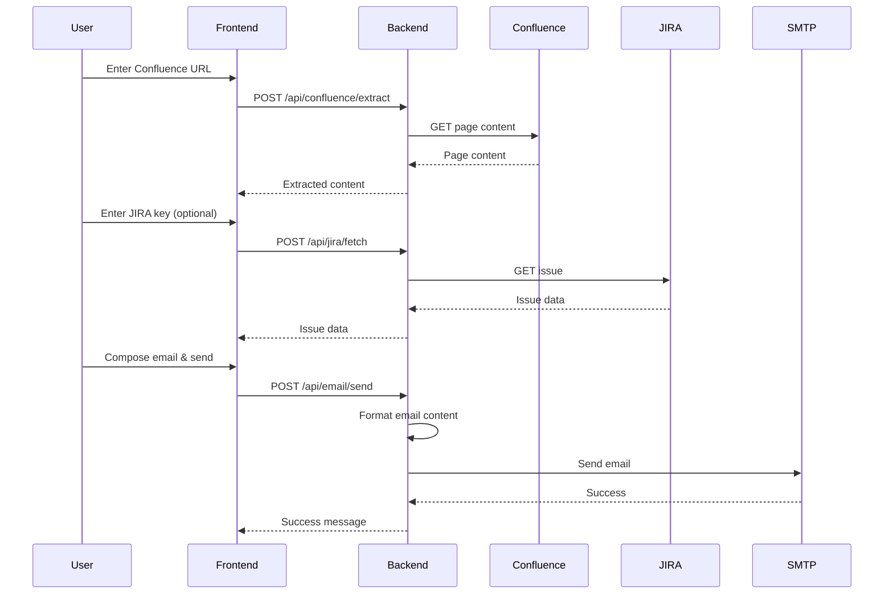

### 3.3 Release Versions Flow

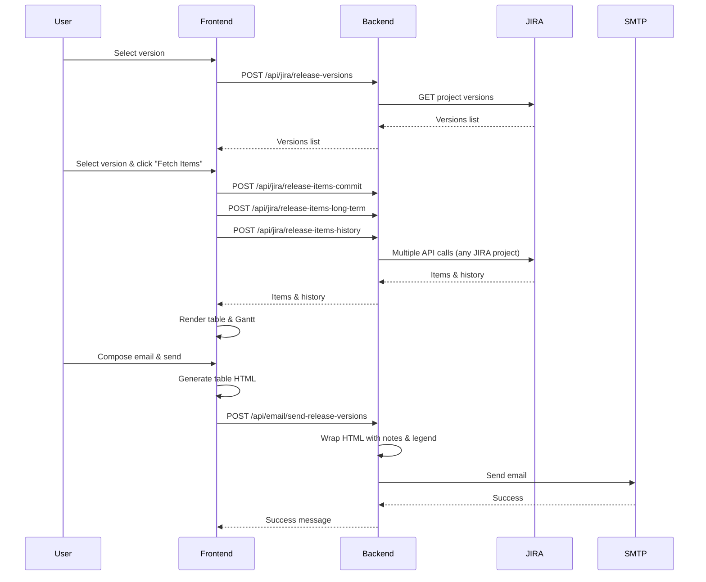

## 4. API Specifications

### 4.1 Authentication Endpoints

#### POST `/api/auth/validate-token`
**Purpose**: Validate JIRA token and extract username

**Request Body**:
```json
{
  "jiraToken": "string"
}
```

**Response**:
```json
{
  "success": true,
  "username": "namratha.singh",
  "email": "namratha.singh@nutanix.com"
}
```

### 4.2 JIRA Endpoints

#### POST `/api/jira/release-versions`
**Purpose**: Fetch all open/unreleased versions from ERA project (versions are project-level, not issue-level)

**Request Body**:
```json
{}
```

**Response**:
```json
{
  "success": true,
  "versions": [
    {
      "id": "12345",
      "name": "NDB-2.11",
      "released": false,
      "archived": false
    }
  ]
}
```

**Note**: Versions are project-level entities from the ERA project.

#### POST `/api/jira/release-items-commit`
**Purpose**: Fetch items with matching fixVersion from ANY JIRA project
- Not restricted to FEAT or ERA projects
- Common sources:
  - FEAT: IssueType in (Feature, X-FEAT) - can be parents to any JIRA project ticket
  - ERA: IssueType in (Initiative, Epic, Capability, etc.) - any issue type except Feature

**Request Body**:
```json
{
  "fixVersion": "NDB-2.11"
}
```

**Response**:
```json
{
  "success": true,
  "data": {
    "items": [
      {
        "key": "FEAT-16821",
        "summary": "Feature summary",
        "status": "In Progress",
        "assignee": "user.name",
        "customfield_11067": "2026-01-30",
        ...
      }
    ]
  }
}
```

**Note**: Items can come from ANY JIRA project (not restricted to FEAT or ERA):
- Common sources: FEAT (Feature, X-FEAT), ERA (Initiative, Epic, Capability, etc. - but NOT Feature)

#### POST `/api/jira/release-items-long-term`
**Purpose**: Fetch items with long-term-funded label from ANY JIRA project
- Not restricted to FEAT or ERA projects
- Common sources:
  - FEAT: IssueType in (Feature, X-FEAT) - can be parents to any JIRA project ticket
  - ERA: IssueType in (Initiative, Epic, Capability, etc.) - any issue type except Feature

**Request Body**:
```json
{
  "fixVersion": "NDB-2.11"
}
```

**Response**: Same format as `/api/jira/release-items-commit`

**Note**: Items can come from ANY JIRA project (not restricted to FEAT or ERA):
- Common sources: FEAT (Feature, X-FEAT), ERA (Initiative, Epic, Capability, etc. - but NOT Feature)

#### POST `/api/jira/release-items-history`
**Purpose**: Fetch checkpoint history for all items from ANY JIRA project (no project filter restrictions)

**Request Body**:
```json
{
  "fixVersion": "NDB-2.11"
}
```

**Response**:
```json
{
  "success": true,
  "data": {
    "history": {
      "FEAT-16821": {
        "codeComplete": ["2026-01-15", "2026-01-20", "2026-01-30"],
        "commitGate": ["2026-02-01"],
        ...
      }
    }
  }
}
```

**Note**: History endpoint includes items from ANY JIRA project (no project filter restrictions).

#### POST `/api/jira/fetch`
**Purpose**: Fetch JIRA ticket data

**Request Body**:
```json
{
  "jiraKey": "FEAT-16821"
}
```

**Response**:
```json
{
  "success": true,
  "data": {
    "key": "FEAT-16821",
    "summary": "Feature summary",
    "status": "In Progress",
    "description": "JIRA wiki markup...",
    ...
  }
}
```

#### POST `/api/jira/fetch-all-jira-tickets`
**Purpose**: Fetch hierarchical structure of Features/Initiatives and their linked Epics for Feature/Initiative/X-FEAT/Capability tickets

**Note**: Endpoint renamed from `/api/jira/fetch-epics` to better reflect its functionality of fetching all related JIRA tickets.

**Request Body**:
```json
{
  "jiraKey": "FEAT-16821"
}
```

**Response**:
```json
{
  "success": true,
  "epics": [
    {
      "key": "FEAT-16821",
      "summary": "Feature summary",
      "status": "In Progress",
      "issueType": "Feature",
      "childEpics": [
        {
          "key": "ERA-12345",
          "summary": "Epic summary",
          "status": "Done",
          "issueType": "Epic"
        }
      ]
    }
  ],
  "count": 1,
  "issueBreakdown": {
    "total": 50,
    "breakdown": [
      {
        "type": "Task",
        "total": 30,
        "statusCategories": {
          "Done": {"Done": 20},
          "In Progress": {"In Progress": 8},
          "To Do": {"To Do": 2}
        }
      }
    ],
    "overallStats": {
      "done": 20,
      "inProgress": 8,
      "toDo": 2,
      "blocked": 0,
      "other": 0,
      "completionRate": "66.7"
    }
  }
}
```

**Logic**:
1. Fetches main ticket to determine issue type (Feature/Initiative/X-FEAT/Capability)
2. Uses different JQL queries based on issue type:
   - **X-FEAT/Capability**: Uses `portfolioChildrenOf`, `linkedIssuesOf`, `issuesInEpics`
   - **Feature/Initiative**: Uses `portfolioChildrenOf`, `issuesInEpics`, `subtasksOf`
3. Filters results:
   - **Features/Initiatives**: Based on Parent Link (customfield_20363) relationships
   - **Epics**: Issues with IssueType = Epic, matched to Features/Initiatives via Parent Link
   - **Other Issues**: For breakdown statistics (excludes Feature/Epic/Initiative/X-FEAT/Capability)
4. Returns hierarchical structure with Features/Initiatives containing their child Epics, plus breakdown statistics

### 4.3 Email Endpoints

#### POST `/api/email/send`
**Purpose**: Send email with Confluence/JIRA content

**Request Body**:
```json
{
  "executiveSummary": "Summary text",
  "additionalDetails": "HTML content",
  "emailRecipients": "user1@nutanix.com; user2@nutanix.com",
  "emailSubject": "Optional subject",
  "jiraKey": "FEAT-16821",
  "jiraData": {...},
  "epics": [...],
  "issueBreakdown": {...},
  "attachPdf": false
}
```

**Response**:
```json
{
  "success": true,
  "message": "Email sent successfully",
  "recipients": ["user1@nutanix.com", "user2@nutanix.com"]
}
```

#### POST `/api/email/send-release-versions`
**Purpose**: Send email with release version table

**Request Body**:
```json
{
  "tableHTML": "<table>...</table>",
  "selectedVersion": "NDB-2.11",
  "highlights": "HTML content",
  "lowlights": "HTML content",
  "callToAction": "HTML content",
  "emailRecipients": "user1@nutanix.com; user2@nutanix.com"
}
```

**Response**:
```json
{
  "success": true,
  "message": "Email sent successfully"
}
```

### 4.4 Config Endpoints

#### GET `/api/config/release-versions-columns`
**Purpose**: Get column configuration

**Response**:
```json
{
  "columns": {
    "key": {
      "label": "Key",
      "includeInUI": true,
      "includeInEmail": true,
      "order": 1,
      "width": "5%"
    },
    ...
  },
  "columnOrder": ["key", "summary", ...],
  "defaultReleaseVersion": "NDB-2.11"
}
```

#### GET `/api/config/release-versions`
**Purpose**: Get Gantt chart configuration

**Response**:
```json
{
  "ecDate": "2026-01-07",
  "lastGADate": "2026-06-30",
  "sprintDates": ["2026-01-07", "2026-01-28", ...]
}
```

## 5. State Management

### 5.1 Frontend State Architecture

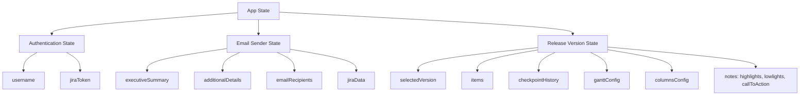

### 5.2 State Storage

- **Authentication**: Stored in `localStorage` (username, jiraToken)
- **Component State**: Managed via React `useState` hooks
- **No Global State Management**: No Redux/Context API (currently)

## 6. Email Generation Pipeline

### 6.1 Email Sender Email Generation

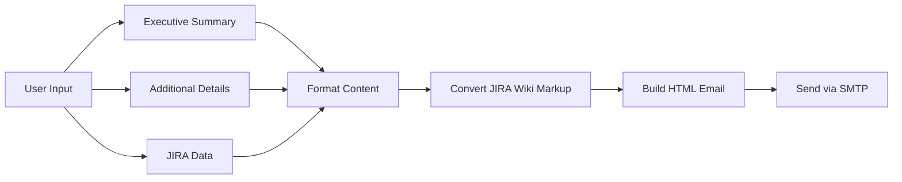

### 6.2 Release Versions Email Generation (Hybrid Approach)

**Current Implementation**: Frontend generates table HTML, backend wraps it with header, notes, and legend.

**Note**: From an architectural perspective, a middleware approach would be ideal for standardizing HTML generation. The current hybrid approach is acceptable as long as it's standardized.

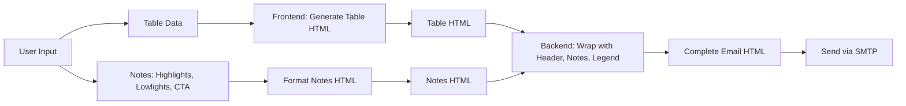

## 7. JIRA Integration Architecture

### 7.1 API Communication

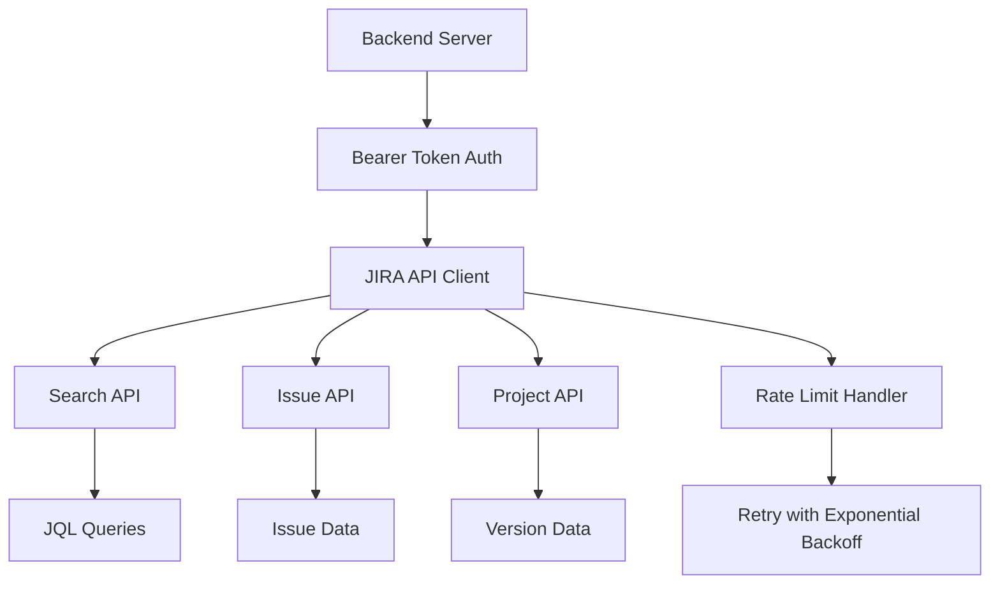

### 7.2 Data Transformation

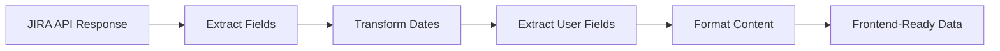

## 8. Security Architecture

### 8.1 Authentication Flow

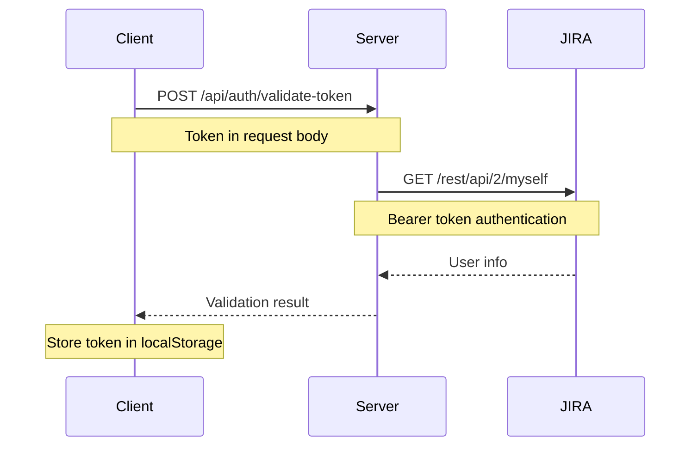

### 8.2 Authorization Flow

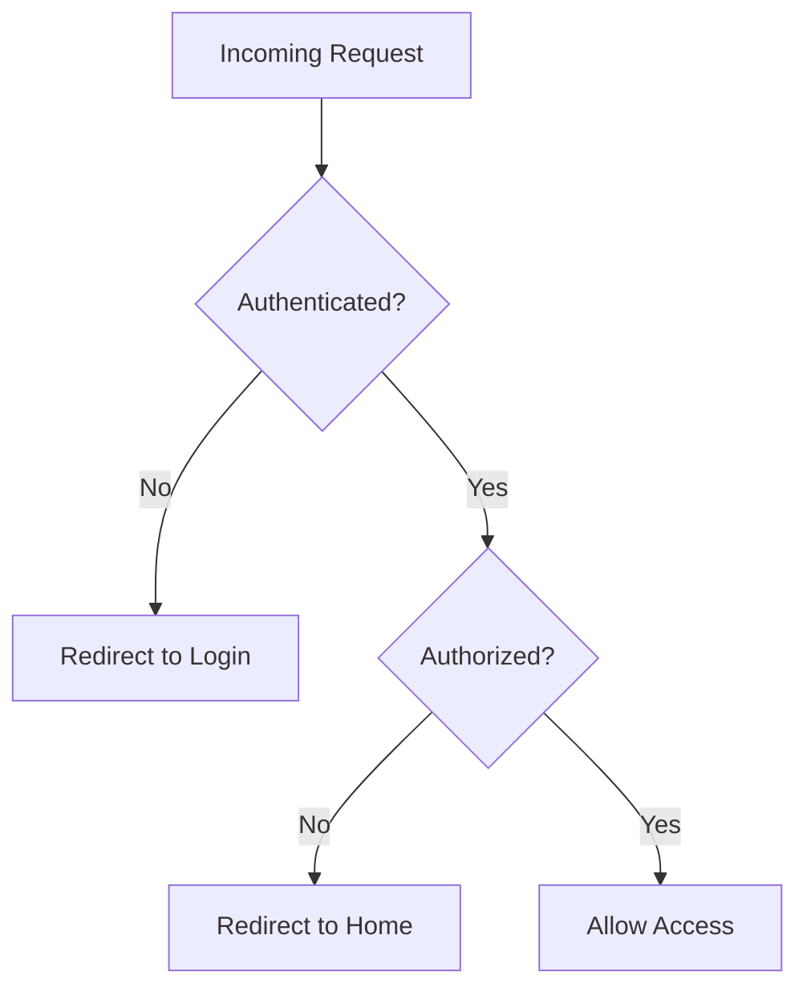

### 8.3 Security Measures

- **Rate Limiting**: Applied to all API endpoints
- **Input Sanitization**: All user inputs sanitized
- **XSS Prevention**: HTML content escaped/validated
- **CORS**: Configured for specific origins
- **Security Headers**: Helmet.js middleware
- **Token Validation**: JIRA token validated on each request

## 9. Error Handling

### 9.1 Error Flow

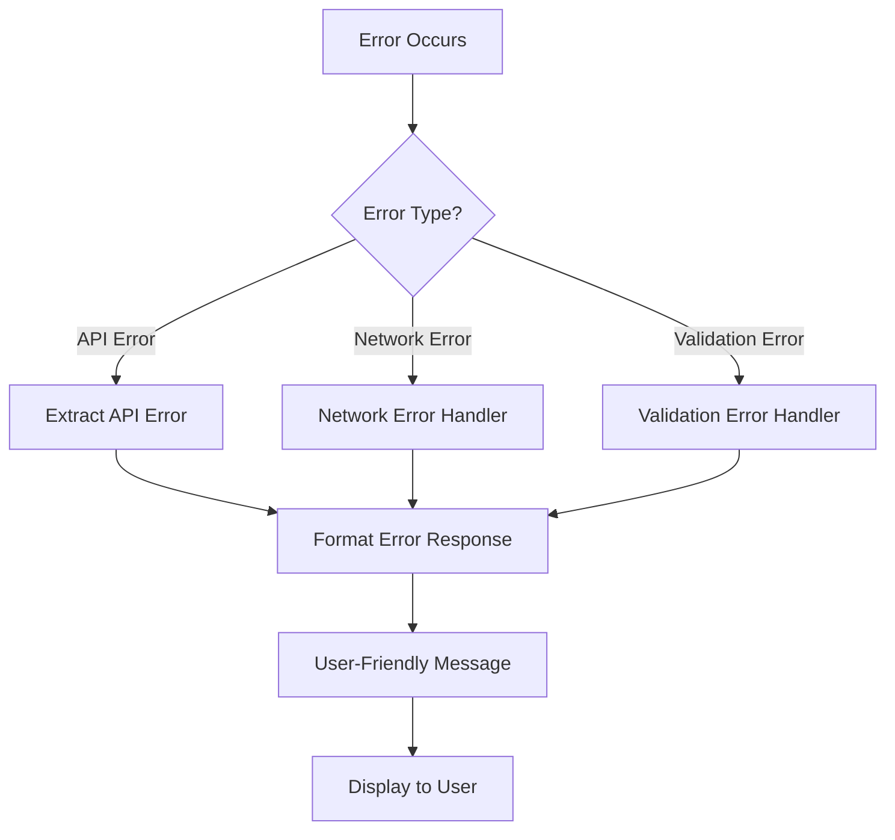

### 9.2 Error Response Format

```json
{
  "success": false,
  "error": "Error message",
  "message": "Detailed error message"
}
```

## 10. Configuration Management

### 10.1 Configuration Files

```
server/config/
├── emailConfig.json          # Default email lists
├── confluenceConfig.json     # Confluence base URL
├── allowedUsers.json         # Authorized users for Release Versions
├── releaseVersionsColumnsConfig.json  # Column configuration
└── releaseVersionsEmailConfig.json    # Gantt chart & email config
```

### 10.2 Environment Variables

```
SMTP_HOST=smtp.gmail.com
SMTP_PORT=587
SMTP_USER=your-email@nutanix.com
SMTP_PASS=your-app-password
PORT=6001
NODE_ENV=production|development
REACT_APP_ENABLE_RELEASE_VERSIONS=true|false
```

## 11. Performance Considerations

### 11.1 Frontend Optimization

- **Code Splitting**: Lazy loading for large components
- **Memoization**: React.memo, useMemo, useCallback
- **Virtual Scrolling**: For large tables (future enhancement)
- **Debouncing**: For search/filter inputs

### 11.2 Backend Optimization

- **Connection Pooling**: HTTPS agent with keepAlive
- **Caching**: Config files cached in memory
- **Compression**: Gzip compression for responses
- **Rate Limiting**: Prevents API abuse
- **Retry Logic**: Exponential backoff for JIRA API

## 12. Testing Strategy

### 12.1 Unit Testing

- **Frontend**: React Testing Library for components
- **Backend**: Jest for utility functions and services
- **Coverage Target**: 80% code coverage

### 12.2 Integration Testing

- **API Endpoints**: Supertest for Express routes
- **JIRA Integration**: Mock JIRA API responses
- **Email Service**: Mock SMTP server

### 12.3 E2E Testing

- **User Workflows**: Cypress/Playwright
- **Critical Paths**:
  - Authentication flow
  - Email composition and sending
  - Release version data fetching
  - Email generation and sending

## 13. Changelog Pagination Architecture

### 13.1 Problem Statement

The JIRA API returns changelog data in paginated format when using `expand=changelog`. When `changelog.total > changelog.histories.length`, the system must fetch additional pages to retrieve all historical date changes. The previous implementation only logged a warning and didn't fetch additional pages, resulting in missing historical data.

### 13.2 Solution Architecture

The solution implements a multi-strategy pagination utility (`server/utils/changelogPagination.js`) that attempts multiple approaches to fetch all changelog histories:

**Strategy 1: maxResults=total**
- Attempts to fetch all results in a single call by setting `maxResults` equal to `changelog.total`
- Most efficient if JIRA API supports it
- Used as the first attempt

**Strategy 2: Issue ID Endpoint**
- Uses the issue ID (not key) with `/rest/api/2/issue/{issueId}/changelog` endpoint
- Supports pagination with `startAt` and `maxResults` parameters
- Falls back to this if Strategy 1 doesn't retrieve all results
- Requires issue ID to be available from the initial fetch

**Strategy 3: Multiple Expand Calls**
- Makes multiple calls with `expand=changelog` and increasing `maxResults` values
- Least efficient but provides a fallback option
- Used only if Strategies 1 and 2 fail

### 13.3 Integration Points

- **`/api/jira/release-items-history`**: Uses pagination utility to fetch all changelog histories for batch processing
- **`/api/jira/checkpoint-history`**: Uses pagination utility for single issue checkpoint history
- Both endpoints pass `issue.id` when available to enable Strategy 2

### 13.4 Error Handling

- Graceful degradation: If pagination fails, the system returns partial data with warnings
- All pagination attempts are logged for debugging
- Warnings are included in the response for monitoring

### 13.5 Performance Considerations

- Rate limiting: 500ms delay between pagination requests
- Timeout: 30 seconds per API call
- Batch processing: Pagination happens per-issue within existing batch processing
- Logging: Comprehensive logging for troubleshooting pagination issues

### 13.6 Utility Function

**`fetchAllChangelogHistories(baseUrl, jiraKey, issueId, token, httpsAgent, retryJiraCall, logger)`**

Returns:
- `histories`: Array of all changelog history entries
- `paginationInfo`: Object with total, fetched, strategies used
- `warnings`: Array of warning messages

## 14. Deployment Architecture

### 13.1 Development Environment

- **Frontend**: React development server (port 6100)
- **Backend**: Node.js server (port 6001)
- **Hot Reload**: Enabled for both frontend and backend

### 13.2 Production Environment

- **Frontend**: Static build served via Nginx/Apache
- **Backend**: Node.js process managed by PM2
- **Load Balancing**: Multiple backend instances
- **SSL/TLS**: HTTPS enabled
- **Monitoring**: Log aggregation and error tracking

## 14. Future Architecture Improvements

### 14.1 Planned Refactoring

1. **Backend Modularization**:
   - Extract routes to separate modules
   - Extract services to separate modules
   - Consolidate utility functions

2. **Frontend Component Splitting**:
   - Split large components into smaller ones
   - Extract custom hooks
   - Consolidate utility functions

3. **State Management**:
   - Consider Context API for shared state
   - Consider Redux for complex state (if needed)

4. **Testing Infrastructure**:
   - Set up Jest for unit tests
   - Set up React Testing Library
   - Set up E2E testing framework

### 14.2 Scalability Considerations

- **Database**: Consider adding database for persistent storage
- **Caching**: Redis for API response caching
- **Queue System**: Bull/Agenda for background jobs
- **Microservices**: Split into separate services if needed

